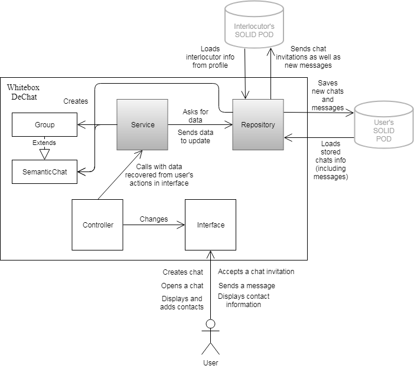
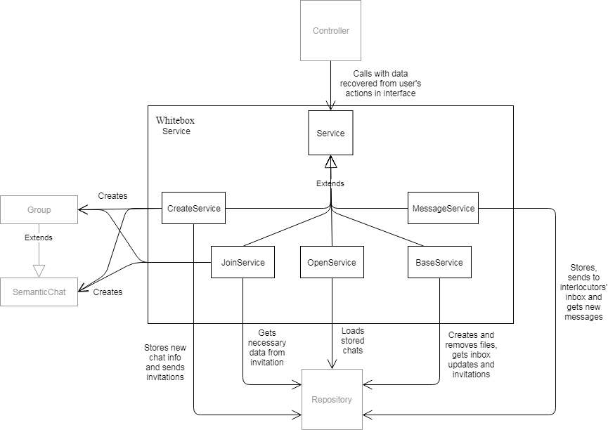

[[section-building-block-view]]

== Building Block View

This section consists of a decomposition of our system into building blocks, showcasing their inner dependencies.

=== Level 1

We begin the decomposition by displaying a white box description of the overall system -manifested in section III, Context Diagrams as 'DeChat' black box-.

It can be swiftly perceived that we have chosen a Model-View-Controller pattern for overall system architecture, reasoning being:
* It is a fairly suitable and easy-to-grasp architecture for web applications such as ours.
* We have created a few applications before using this approach.

.Black Box descriptions
|===
|Name |Responsibility

|Service
|Performs an operation ordered by the Controller or another Service, working with user-provided data to persist or select information through Repository. Creates, joins and opens a chat, as well as storing and loading messages, either written by the user or received at his POD's inbox.

|Repository
|Either persists the data provided by a Service -inserts or updates data in current user's private POD folder as well as interlocutors' inbox- or selects stored/received data from current user's POD.
|===

=== Level 2

==== White Box Service

It was determined that, in order to make the main logic more sustainable as well as comfortable to work with, it would be decomposed into 5 classes -services, since we opted for MVC-, which encapsulate the main features needed for basic chat communication.
Those being the following:

* BaseService. Contains basic functionality which is commonly needed and doesn't fall under any category.
* CreateService. Creates chats/groups, storing in user's POD whatever information is needed and sending invites to all participants.
* JoinService. Processes invitations to create a replica of the chat in invited user's POD.
* OpenService. Loads all information about stored chats and any messages it contains-.
* MessageService. Looks for new messages in inbox to store them if necessary, as well as stores new messages created at current session and sends them to any participants' inboxes.

Since there were common imports to all of them, sharing constructor as well, we abstracted a Service superclass to avoid duplicating code.

==== White Box Repository

image::images/BBLevel2Repository.png[Building Block Level 3 - Repository,800]

There are three main clases conforming persistance functionality:

* RDFJSSourceFactory. Given an URL, provides a RDFJS Source to make queries with Engine.
* SolidLoaderRepository. Through the source provided by the latter, it collects chat info from any accesible URL to form a domain object, which will be used by whatever Service has required it.
* SolidUploaderRepository. Executes SPARQL updates and insertions. Capable of deleting files, also.

The objective of this block is to provide CRUD operations for all of the Services, so that any chat-related information may be recovered or persisted. It plays a rather significant role, since it is the responsible of handling POD usage in both directions.

