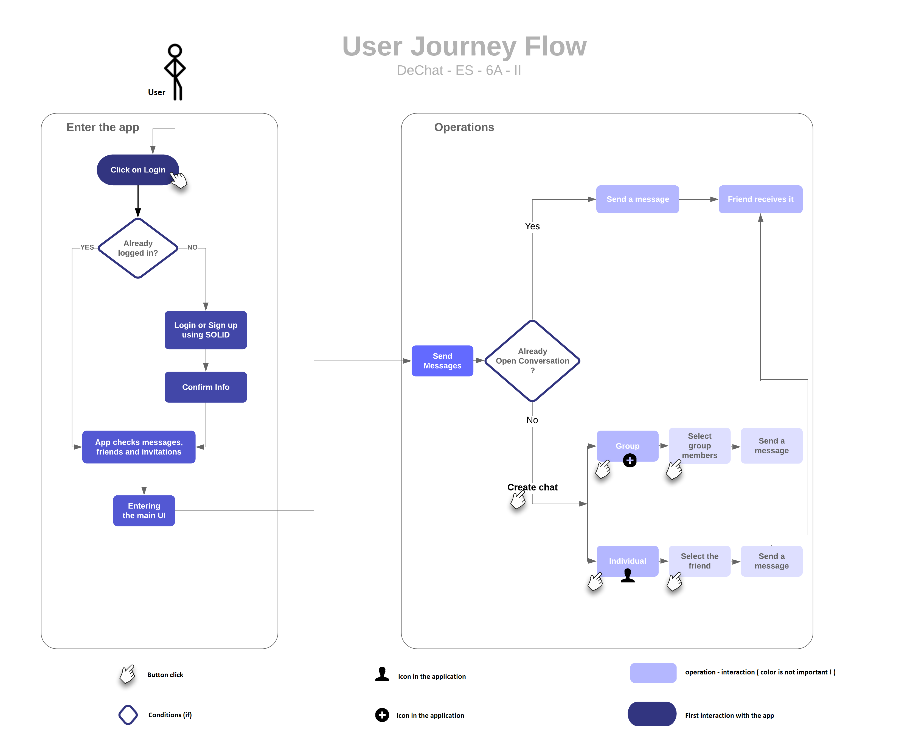

[[section-runtime-view]]
== Runtime View

****
In this section, we will describe the behavior and interactions of the system’s
building blocks in form of scenarios.
****

=== Scenarios

==== Main Scenario : the user's journey flow.
===== User journey flowchart

===== User journey in details
1 -> Entering the main app

2 -> Click on Login

  -> Login or Sign up
  -> Confirm information

3 -> The app loads all the data necessary including the user's friends and invitations and messages.

4 -> User wants to send or view messages

  -> Already open conversation

  -> Creating a new conversation
    -> group
      - user select the members he wants to add
      - click on add
      - the conversation is created and the members are notified
      - now anyone can join and exchange messages
    -> individual
      - user select the friend
      - click on it
      - the conversation is created and the friend is notified
      - now the users can exchange messages

==== Second Scenario : Login Process

===== Login flowchart
image:images/loginProcess.png[login flowchart,800]

===== Login runtime view in details
When entering the webpage, there are two possibilities :

1 -> the user's already logged in or connected in *solid.community/* for example

2 -> the user's not logged in, the user nust *click* on *Login*

  -> If the user has an account
    - click on the provider and fill the login form.

  -> If the user doesn't have an account
    - there is the possibility to register and create a personal POD.
    - Login using the entered informatin in the register process.

3 -> the app will load automatically all the user's data including the conversations, friends and invitations.

4 -> now the user is in the main UI.

==== Third Scenario : *User A* Sends Message to *User B*
===== Sending messages Flowchart
image::sendMessages.png[messages flowchart,800]

===== sending messages in details
In the case of an already open conversation, the user *User A* selects it and decides to send a message to his friend *User B*

1 -> *User A* send the messages.

2 -> The app places this conversation for *User A* in the *first* place.

3 -> *User B* receives it and the app places the conversation in the *first* place with a notification.

4 -> The UI view is updated for *User A* and *User B* with the message sent.
