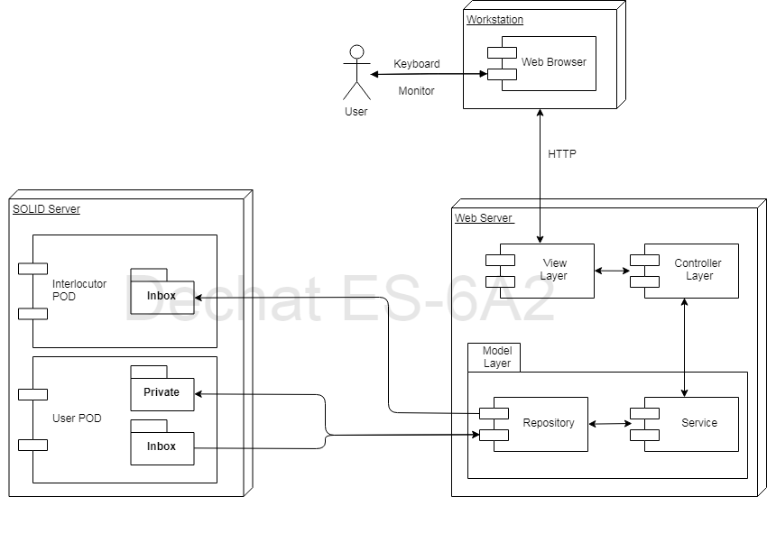

[[section-deployment-view]]

== Deployment View

.Infrastructure overview

=== Motivation

It was established as an early constraint that SOLID was to be used as the basis for our communication app. Thus, its presence in the infrastructure as the final step for data management is not a surprising view.
However, we did decide to go for a Web Application, since a) we had the most resources to take as guidance, b) it provides ease of usage for the average user and c) GitHub provides an option to serve our web app.
Hence, the presence of the Web Server and Web Browser blocks in the infrastructure.

As it has been stressed previously, its web server may be found at https://arquisoft.github.io/dechat_es6a2/, thanks to GitHub Pages feature. A secondary approach is provided, given the circunstances ask for it:
after having cloned the repository, the user may run the command http-server at root directory; he will be provided with some IP directions to access (it is mandatory to add "/src" to the URL).

=== Mapping

Previously defined building blocks are always deployed the same way: a file is generated through the processing of ChatController, an action which in cascade maps all involved classes into a main.js file, with all of the Node dependencies solved.
This file is linked to the View (index.html) as an script, so that related code is executed by the browser of choice in response to user's actions on the presentation layer.
